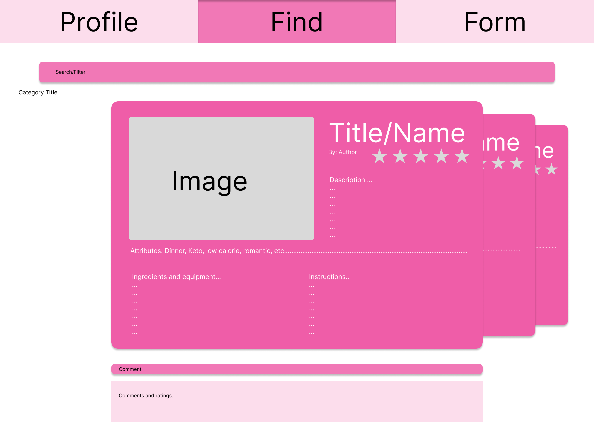

# UI Diagrams and descriptions

## For you page

This page will serve as the main page or home page of the application.
It displays a list of recipes that you are able to scroll, like and delve deeper into the step by step instructions and ingredients. This view provides a quick and easily digestible way of receiving recipes right when you log on. It will potentially have more features that allows more manipulation of the page and social interaction.

## Your personal page

## Sign in / register page
This page will serve as both the log in and the sign page
It will display different form depending on the button you press, whether is sign in or register it will change the page form with a button. If the page is set to register, it will ask the user to input their email and create a password. If the page is set to sign in, the user will be able to use the previously created account to sign into the application.

## Form page
