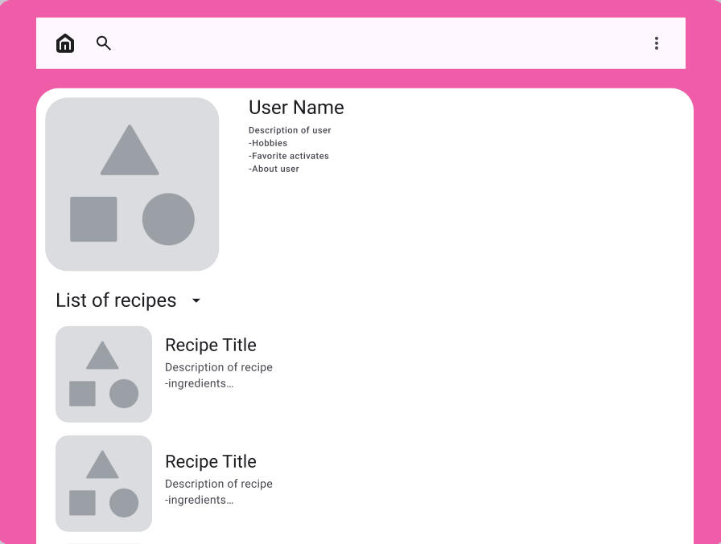
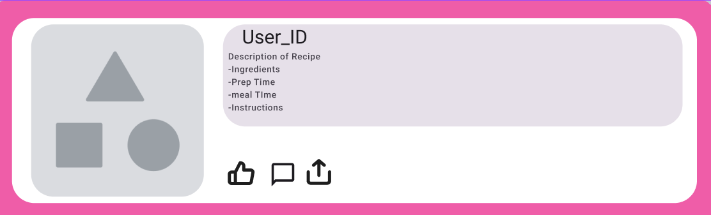

# UI Diagrams and descriptions Milestone #3

## For you page / Community page

This page is the main and home page of the application. It displays a list of recipes that you can scroll, like, comment and click on to see the details of the recipe including the step by step instructions and ingredients. This view provides a quick way to see many recipes right when you log in and to scroll through and choose the recipe of your choice to use.

# UI Diagrams and descriptions
## For you page

## For you page

This page will serve as the main page or home page of the application.
It displays a list of recipes that you are able to scroll, like and delve deeper into the step by step instructions and ingredients. This view provides a quick and easily digestible way of receiving recipes right when you log on. It will potentially have more features that allows more manipulation of the page and social interaction.

## The elements on this screen consist of

The scrollable list of recipe cards that will continue generating as you scroll.
The search/filter feature which will changes the list or add a new list that applies the filter or generates results from your search
The comment box that lets you comment on the recipe above it. As well as another scrollable comment section below it
The tabs at the top are subject to change but they should be clickable and indicate which tab you are on.

## Use case

For users who need to make food and want to quickly survey their options and start making one. It also serves as a past time recipe inspiration tool that users can use to plan for furture meals by saving.

## Your personal page

This page will serve as the personal profile page for the user. It displays the user's information, including their name, description, hobbies, favorite activities, and other personal details. Additionally, it features a curated list of recipes associated with the user. Each recipe is presented in a scannable format, providing quick access to descriptions and ingredients. Users can browse, interact with, and explore recipes directly from this page. Future enhancements may include features for personalization, social engagement, and customization of the user’s profile and recipe lists.

## Sign in / register page

This page will serve as both the log in and the sign page
It will display different form depending on the button you press, whether is sign in or register it will change the page form with a button. If the page is set to register, it will ask the user to input their email and create a password. If the page is set to sign in, the user will be able to use the previously created account to sign into the application.

## Form page

This form serves as a detailed recipe entry or individual recipe page. It provides all essential information about the selected recipe, including a brief description, a list of ingredients, preparation time, meal time, and step-by-step instructions. The layout offers quick actions such as liking the recipe, leaving comments, or sharing it with others, enhancing user engagement and interactivity.

